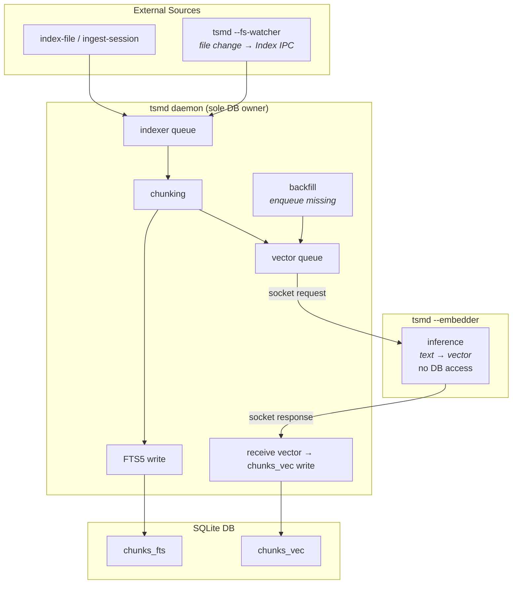
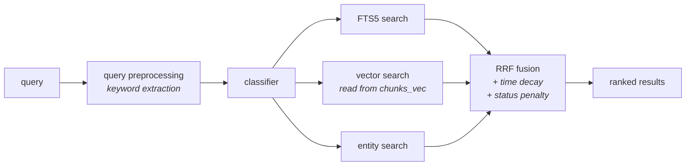

# Data Flow

## Indexing Flow

```mermaid
flowchart TB
    subgraph External["External Sources"]
        IF["index-file / ingest-session"]
        WD["tsmd --fs-watcher<br/><i>file change → Index IPC</i>"]
    end

    subgraph Main["tsmd daemon (sole DB owner)"]
        IQ["indexer queue"]
        CH["chunking"]
        FTS["FTS5 write"]
        VQ["vector queue"]
        VW["receive vector → chunks_vec write"]
        BF["backfill<br/><i>enqueue missing</i>"]
    end

    subgraph Embedder["tsmd --embedder"]
        INF["inference<br/><i>text → vector</i><br/>no DB access"]
    end

    subgraph DB["SQLite DB"]
        FDB["chunks_fts"]
        VDB["chunks_vec"]
    end

    IF --> IQ
    WD --> IQ
    IQ --> CH --> FTS --> FDB
    CH --> VQ
    BF --> VQ
    VQ -->|"socket request"| INF
    INF -->|"socket response"| VW
    VW --> VDB
```

## Component Responsibilities

```mermaid
graph LR
    subgraph Main["tsmd daemon"]
        direction TB
        M1["DB ownership<br/>All reads & writes"]
        M2["Indexer queue"]
        M3["Vector queue"]
        M4["Backfill coordination"]
    end

    subgraph Embedder["tsmd --embedder"]
        direction TB
        E1["Model inference only"]
        E2["Stateless"]
        E3["No DB access"]
    end

    subgraph Watcher["tsmd --fs-watcher"]
        direction TB
        W1["File system monitoring"]
        W2["inotify / FSEvents"]
        W3["Stateless"]
        W4["No DB access"]
    end

    Watcher -->|"file path"| Main
    Main -->|"text"| Embedder
    Embedder -->|"vector"| Main
```

## Search Flow

```mermaid
flowchart LR
    Q["query"] --> QP["query preprocessing<br/><i>keyword extraction</i>"]
    QP --> CL["classifier"]
    CL --> FTS["FTS5 search"]
    CL --> VEC["vector search<br/><i>read from chunks_vec</i>"]
    CL --> ENT["entity search"]
    FTS --> RRF["RRF fusion<br/><i>+ time decay</i><br/><i>+ status penalty</i>"]
    VEC --> RRF
    ENT --> RRF
    RRF --> R["ranked results"]
```
